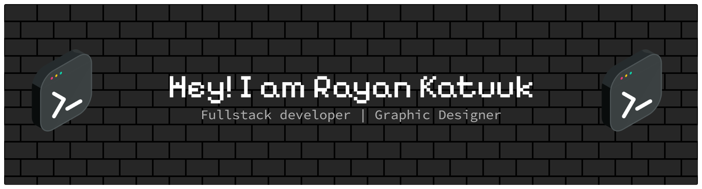

<!-- <h1 align='center'>
  Hi there 👋 I'm Rayan Katuuk 👨‍💻
</h1> -->

<h5 align='center'>
  Skills  
</h5>

<h5 align='center'>

  
</h5>

<h5 align='center'>
  💻 My workspace  
  
  
  
  
   </h5>

<h5 align='center'>
Connect With Me 
</h5>

  
  
    

